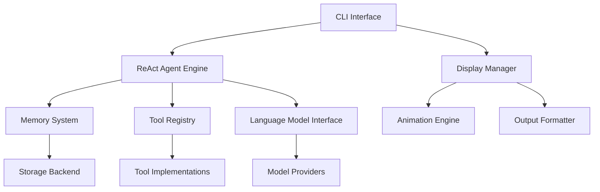

# Design Document

## Overview

The AI Agent System is a Python-based CLI application that implements the ReAct (Reasoning and Acting) framework to create intelligent agents capable of autonomous task execution. The system features a modular, interface-driven architecture that enables easy extension of capabilities while providing an engaging user experience through rich terminal interactions.

The core philosophy centers around the ReAct cycle: the agent reasons about problems, acts using available tools, observes results, and continues this cycle until tasks are completed. The system maintains conversation memory and provides real-time feedback to users through animated progress indicators and informative status updates.

## Architecture

### High-Level Architecture



### Core Components

1. **CLI Interface Layer**: Handles user input/output and terminal management
2. **ReAct Agent Engine**: Implements the reasoning-acting cycle
3. **Memory System**: Manages conversation history and context
4. **Tool Registry**: Manages available tools and their execution
5. **Language Model Interface**: Abstracts different AI model providers
6. **Display Manager**: Handles rich terminal output and animations

### Interface-Based Design

The system uses abstract base classes (ABCs) to define clear contracts:

- `AgentInterface`: Defines agent behavior and lifecycle
- `MemoryInterface`: Defines memory storage and retrieval
- `ToolInterface`: Defines tool registration and execution
- `ModelInterface`: Defines language model interactions
- `DisplayInterface`: Defines output formatting and animations

## Components and Interfaces

### 1. CLI Interface Layer

**Purpose**: Manages terminal interactions and user experience

**Key Classes**:
- `CLIApplication`: Main application entry point
- `CommandParser`: Handles command parsing and validation
- `SessionManager`: Manages user sessions and state

**Interface**: `CLIInterface`
```python
class CLIInterface(ABC):
    @abstractmethod
    def start_session(self) -> None
    @abstractmethod
    def handle_input(self, user_input: str) -> None
    @abstractmethod
    def display_output(self, content: str, output_type: str) -> None
    @abstractmethod
    def show_progress(self, message: str, progress: float) -> None
```

### 2. ReAct Agent Engine

**Purpose**: Implements the core reasoning-acting cycle

**Key Classes**:
- `ReActAgent`: Main agent implementation
- `ReasoningEngine`: Handles thought processes
- `ActionExecutor`: Manages action execution
- `ObservationProcessor`: Processes action results

**Interface**: `AgentInterface`
```python
class AgentInterface(ABC):
    @abstractmethod
    def process_input(self, user_input: str) -> str
    @abstractmethod
    def execute_task(self, task: str) -> TaskResult
    @abstractmethod
    def get_available_actions(self) -> List[str]
    @abstractmethod
    def reset_context(self) -> None
```

### 3. Memory System

**Purpose**: Manages conversation history and context persistence

**Key Classes**:
- `ConversationMemory`: Stores conversation history
- `ContextManager`: Manages working memory and context
- `MemoryPersistence`: Handles data persistence

**Interface**: `MemoryInterface`
```python
class MemoryInterface(ABC):
    @abstractmethod
    def store_message(self, message: Message) -> None
    @abstractmethod
    def retrieve_history(self, limit: int = None) -> List[Message]
    @abstractmethod
    def get_context(self) -> Dict[str, Any]
    @abstractmethod
    def clear_memory(self) -> None
```

### 4. Tool Registry

**Purpose**: Manages available tools and their execution

**Key Classes**:
- `ToolRegistry`: Central tool management
- `ToolExecutor`: Handles tool execution
- `ToolValidator`: Validates tool inputs and outputs

**Interface**: `ToolInterface`
```python
class ToolInterface(ABC):
    @abstractmethod
    def register_tool(self, tool: Tool) -> None
    @abstractmethod
    def execute_tool(self, tool_name: str, params: Dict) -> ToolResult
    @abstractmethod
    def get_available_tools(self) -> List[ToolInfo]
    @abstractmethod
    def validate_tool_input(self, tool_name: str, params: Dict) -> bool
```

### 5. Language Model Interface

**Purpose**: Abstracts different AI model providers

**Key Classes**:
- `ModelProvider`: Base class for model providers
- `OpenAIProvider`: OpenAI API implementation
- `LocalModelProvider`: Local model implementation

**Interface**: `ModelInterface`
```python
class ModelInterface(ABC):
    @abstractmethod
    def generate_response(self, prompt: str, context: Dict) -> str
    @abstractmethod
    def generate_reasoning(self, problem: str) -> str
    @abstractmethod
    def is_available(self) -> bool
    @abstractmethod
    def get_model_info(self) -> ModelInfo
```

### 6. Display Manager

**Purpose**: Handles rich terminal output and user engagement

**Key Classes**:
- `DisplayManager`: Coordinates output display
- `AnimationEngine`: Manages progress animations
- `OutputFormatter`: Formats different types of content
- `ProgressTracker`: Tracks and displays operation progress

**Interface**: `DisplayInterface`
```python
class DisplayInterface(ABC):
    @abstractmethod
    def show_message(self, message: str, style: str) -> None
    @abstractmethod
    def show_progress(self, operation: str, progress: float) -> None
    @abstractmethod
    def show_animation(self, animation_type: str) -> None
    @abstractmethod
    def format_output(self, content: Any, format_type: str) -> str
```

## Data Models

### Core Data Structures

```python
@dataclass
class Message:
    id: str
    content: str
    role: str  # 'user', 'agent', 'system'
    timestamp: datetime
    metadata: Dict[str, Any]

@dataclass
class TaskResult:
    success: bool
    result: Any
    error_message: Optional[str]
    execution_time: float
    steps_taken: List[str]

@dataclass
class ToolInfo:
    name: str
    description: str
    parameters: Dict[str, Any]
    category: str
    enabled: bool

@dataclass
class AgentState:
    current_task: Optional[str]
    reasoning_history: List[str]
    action_history: List[Dict]
    context: Dict[str, Any]
    is_active: bool
```

### Configuration Models

```python
@dataclass
class AgentConfig:
    model_provider: str
    model_name: str
    max_reasoning_steps: int
    tool_timeout: float
    memory_limit: int

@dataclass
class DisplayConfig:
    animation_speed: float
    color_scheme: str
    progress_style: str
    verbose_mode: bool
```

## Error Handling

### Error Categories

1. **User Input Errors**: Invalid commands or parameters
2. **Tool Execution Errors**: Tool failures or timeouts
3. **Model Errors**: AI model unavailability or API failures
4. **Memory Errors**: Storage or retrieval failures
5. **System Errors**: Resource constraints or configuration issues

### Error Handling Strategy

- **Graceful Degradation**: System continues operating with reduced functionality
- **User-Friendly Messages**: Clear, actionable error messages
- **Recovery Mechanisms**: Automatic retry with exponential backoff
- **Logging**: Comprehensive logging for debugging and monitoring

### Error Classes

```python
class AgentError(Exception):
    """Base exception for agent-related errors"""
    pass

class ToolExecutionError(AgentError):
    """Raised when tool execution fails"""
    pass

class MemoryError(AgentError):
    """Raised when memory operations fail"""
    pass

class ModelError(AgentError):
    """Raised when model interactions fail"""
    pass
```

## Testing Strategy

### Testing Levels

1. **Unit Tests**: Individual component testing
2. **Integration Tests**: Component interaction testing
3. **End-to-End Tests**: Full workflow testing
4. **Performance Tests**: Load and stress testing

### Test Categories

- **Interface Compliance**: Verify all implementations follow interfaces
- **ReAct Cycle Testing**: Validate reasoning-acting behavior
- **Tool Integration**: Test tool registration and execution
- **Memory Persistence**: Verify data storage and retrieval
- **CLI Interaction**: Test user input/output handling
- **Animation and Display**: Verify rich terminal output

### Testing Tools

- **pytest**: Primary testing framework
- **pytest-asyncio**: For asynchronous testing
- **mock**: For mocking external dependencies
- **coverage**: Code coverage analysis
- **hypothesis**: Property-based testing for edge cases

### Test Structure

```
tests/
├── unit/
│   ├── test_agent.py
│   ├── test_memory.py
│   ├── test_tools.py
│   └── test_display.py
├── integration/
│   ├── test_agent_memory.py
│   ├── test_tool_execution.py
│   └── test_cli_workflow.py
├── e2e/
│   ├── test_complete_tasks.py
│   └── test_user_scenarios.py
└── fixtures/
    ├── sample_conversations.json
    └── mock_tools.py
```